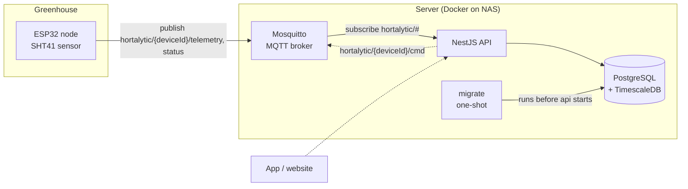

# Hortalytic API

Backend for **Hortalytic**, a system for monitoring and, later, automating greenhouses.

ESP32 devices with sensors placed in a greenhouse send measurements over MQTT. This repository holds the NestJS backend and the infrastructure around it: the MQTT broker, the time series database and the deployment setup. The long term goal is to supply devices to other greenhouse owners, collect their data and present it in an app or website.

The project is currently a proof of concept running with a single device in my own greenhouse.

Firmware for the devices lives in [hortalytic-node](https://github.com/Guruen/hortalytic-node).

## Architecture



Dashed lines are planned and not yet built.

### Contracts

| | |
|---|---|
| Topics | `hortalytic/{deviceId}/telemetry`, `hortalytic/{deviceId}/status`, `hortalytic/{deviceId}/cmd` |
| Payload | Versioned JSON (field `v`) that carries the device's own timestamp |
| Data model | User → Greenhouse → Device → Reading |
| Device identity | `deviceId` is the device's MQTT username. `hortalytic-api` is reserved for the backend |

## Tech stack

- **NestJS** on Node 24, TypeScript, native ESM
- **MQTT** with Eclipse Mosquitto 2
- **PostgreSQL 17 + TimescaleDB** for measurements
- **Drizzle ORM** with the postgres.js driver, migrations with drizzle-kit
- **Zod** for configuration validation
- **Vitest** (via unplugin-swc so decorator metadata works) and **Testcontainers** for integration tests
- **oxlint** and Prettier
- **Docker Compose** for local development and for production on a NAS

## Design decisions

**MQTT instead of HTTP for devices.** The devices are small microcontrollers on greenhouse Wi-Fi that can be unreliable. MQTT keeps one lightweight connection open, has QoS and retained messages built in, and gives a natural channel back to the device (`cmd`) without the device having to poll or run an HTTP server that is reachable from outside. It also decouples the devices from the API: the broker keeps accepting messages while the API restarts.

**Credentials and ACL per device.** Every device has its own MQTT username and password, never a shared key. The ACL uses Mosquitto's `%u` pattern so a device can only write to its own `telemetry` and `status` topics and only read its own `cmd` topic. A compromised or misbehaving device cannot publish on behalf of another one. The backend user has access to `hortalytic/#`. The username `hortalytic-api` is also blocked as a device id by a check constraint in the database.

```
user hortalytic-api
topic readwrite hortalytic/#

pattern write hortalytic/%u/telemetry
pattern write hortalytic/%u/status
pattern read  hortalytic/%u/cmd
```

**Readings in long format.** Measurements are stored as one row per value: `(time, device_id, sensor, metric, value)`. Adding a new sensor type, such as light or soil moisture, requires no schema change or migration. It also makes queries across devices and metrics uniform. The trade off is more rows, which is what TimescaleDB is built to handle.

**TimescaleDB hypertable.** `readings` is a hypertable partitioned on `time`. Because TimescaleDB requires unique constraints to include the partitioning column, the primary key is `(device_id, sensor, metric, time)`. That key doubles as idempotency: MQTT can redeliver a message, and inserts use `ON CONFLICT DO NOTHING`, so a duplicate is silently ignored. An index on `(device_id, time DESC)` serves the typical "latest readings for this device" query.

**Device timestamp, not server timestamp.** The payload carries the time the device took the measurement. This keeps data correct when messages are delayed or buffered.

**Drizzle, because of TimescaleDB migrations.** Drizzle keeps the schema in plain TypeScript next to the module that owns it and generates readable SQL migrations that are committed to `drizzle/`. Crucially, it allows custom SQL migrations in the same migration history, which is where TimescaleDB specific statements like `create_hypertable` live. `drizzle-kit push` is never used, since it knows nothing about hypertables and would drift from the migration history.

**Migrations as a one-shot service.** In production, migrations do not run on application startup. A separate `migrate` service in `compose.prod.yaml` runs them once, and the API only starts if it completed successfully. drizzle-kit stays out of the production image because the migration runner uses `drizzle-orm`'s migrator directly.

**Modular monolith.** Code is organised in feature modules under `src/modules/` (ingestion, devices, telemetry, greenhouses, users, auth). Each module owns its tables. The ingestion module may only depend on devices and telemetry and contains no business logic, so it can later be lifted out as a separate app in a Nest monorepo if ingestion needs to scale independently. One deployable keeps operations simple while the boundaries are still being discovered.

**Devices can exist without an owner.** `greenhouse_id` on a device is nullable, so a device can be registered first and claimed by a user later.

**Validated configuration.** All environment variables are validated with Zod at startup, and the app refuses to start on invalid config. The migration script and `drizzle.config.ts` reuse a subset of the same schema.

**Mosquitto file permissions handled in the container.** Mosquitto 2 requires `passwd` and `acl` to be owned by uid 1883 with mode `0700`, which cannot be relied on for bind mounts from Windows or a NAS. A small entrypoint copies the files into the container's own filesystem with the right owner and mode on every start, so the setup behaves the same on every host.

**Integration tests against the real database.** Schema behaviour that matters (hypertable, index, duplicate handling, foreign keys, the reserved id) is tested against a real TimescaleDB started with Testcontainers, using the same pinned image as the compose files.

## Getting started

Requirements: Node 24, Docker.

`compose.yaml` starts TimescaleDB and Mosquitto. The API runs on the host.

> `docker/mosquitto/passwd` must exist **before** the first `docker compose up`. Mosquitto will not start without it. The file is git ignored and has to be created on every machine.

```bash
npm install

# 1. Environment: fill in the passwords
cp .env.example .env

# 2. Create the passwd file with the backend user.
#    Use the same password as MQTT_PASSWORD in .env
docker compose run --rm --entrypoint mosquitto_passwd mosquitto -b -c /mosquitto/config-src/passwd hortalytic-api <MQTT_PASSWORD>

# 3. Start the infrastructure and run migrations
docker compose up -d
npm run db:migrate

# 4. Start the API in watch mode
npm run start:dev
```

`-b` (batch mode) takes the password as an argument. It is used because the interactive password prompt does not work through `docker compose run` on Windows ("Error: Empty password"). The downside is that the password ends up in shell history. On Linux or macOS you can drop `-b` and the password argument to get the interactive prompt instead.

### Add a device

The username is the device id (`hortalytic-api` is reserved). Leave out `-c`, since it overwrites the file:

```bash
docker compose run --rm --entrypoint mosquitto_passwd mosquitto -b /mosquitto/config-src/passwd <deviceId> <password>
docker compose restart mosquitto
```

Mosquitto has to be restarted after changes to `passwd` or `acl`, because the entrypoint copies them in at startup.

### Database

```bash
# After changing a *.schema.ts: generate a migration in drizzle/ and commit it
npm run db:generate

# TimescaleDB specific SQL (hypertables, policies) as a custom migration
npx drizzle-kit generate --custom --name=<name>

# Run migrations against the local database
npm run db:migrate
```

### Tests

```bash
npm run test       # unit tests
npm run test:int   # integration tests against TimescaleDB in Testcontainers (Docker must be running)
npm run test:cov   # coverage
npm run lint
```

### Production (NAS)

Production runs the API, TimescaleDB and Mosquitto with `compose.prod.yaml`. The API image is built on the NAS. It needs the repository, `.env` and `docker/mosquitto/passwd`, created as above but with `-f compose.prod.yaml`:

```bash
docker compose -f compose.prod.yaml run --rm --entrypoint mosquitto_passwd mosquitto -b -c /mosquitto/config-src/passwd hortalytic-api <MQTT_PASSWORD>
docker compose -f compose.prod.yaml up -d --build
```

If a migration fails, the API does not start. Check with `docker compose -f compose.prod.yaml logs migrate`.

## Status

Built:

- Project setup: NestJS with ESM, Vitest, oxlint, multi-stage Dockerfile
- Config validation at startup
- Global database module with Drizzle and graceful shutdown
- Schema for `devices` and `readings`, with `readings` as a TimescaleDB hypertable
- One-shot migration service for production
- Integration tests for the schema against real TimescaleDB
- Mosquitto with authentication and per-device ACL, local and production compose setups

Not built yet:

- The MQTT client and ingestion module that subscribes to telemetry and writes readings
- Greenhouses, users and auth

## Roadmap

1. Ingestion: subscribe to `hortalytic/+/telemetry`, validate versioned payloads, write readings idempotently, update `last_seen_at`
2. Device status handling (`status` topic) and a REST API for reading data
3. Users, greenhouses and device claiming
4. TLS on port 8883 so devices can connect from outside the LAN
5. Retention and aggregation policies in TimescaleDB
6. Commands to devices over the `cmd` topic as the basis for automation
7. App or website for greenhouse owners

## Related repository

- [hortalytic-node](https://github.com/Guruen/hortalytic-node): ESP32 firmware for the sensor devices

## About the developer

Brian Brandt, developer with a focus on backend. I work mainly with NestJS, TypeScript and microservices.

- GitHub: [Guruen](https://github.com/Guruen)
- LinkedIn: [LINKEDIN_URL]

## License

Copyright (c) 2026 Brian Brandt. All rights reserved.

This is proprietary software. The source code is public for viewing only, as reference and portfolio. It may not be used, copied, modified or distributed without prior written permission. See [LICENSE](LICENSE).

NestJS and the other dependencies are covered by their own licenses.
